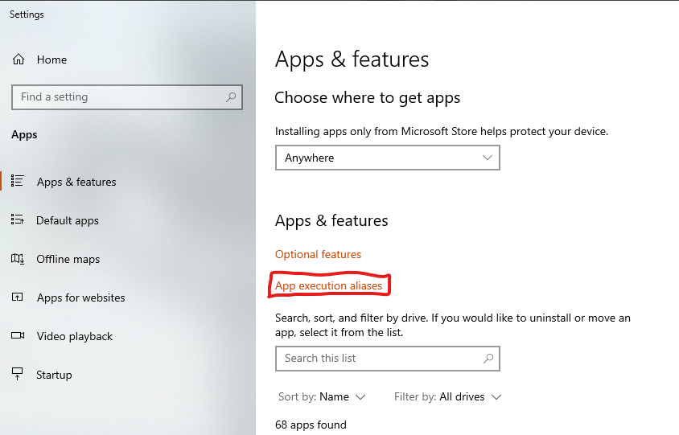
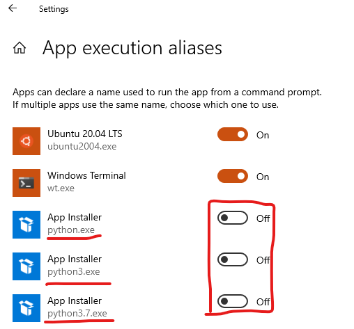

# Chapter 2 Installation

## Download Python

Download the latest version of Python from [https://www.python.org/](https://www.python.org/).  Most Windows devices should use the recommended `Windows Installer (64bit)` option.  Downloading from this site will give you the full Python version, rather than the more limited version available in the Windows Store.  The rest of this page will describe the Windows installation, although a similar process applies to other operating systems.  

## Install Python

If you downloaded the `Windows Installer`, then click on it to start the installation.  You should see a window like this:


First check the box next to `Add Python to PATH`, and then click on `Install Now`.  You can find more details on Windows Python installations here: [https://docs.python.org/3/using/windows.html](https://docs.python.org/3/using/windows.html).  

## Disable App Auto-Install

If you type `python` in the command line, Windows will by default take you to the Store to prompt you to install the App version.  You should disable this as follows.

In the Windows Settings menu select `Apps & Features`, and from this select `App execution aliases`



In this window, turn off all of the Python App Installer options like this:



## Test Python

In a command window type `python` and you should see something like the following:
```
C:\Users\morri>python
Python 3.9.5 (tags/v3.9.5:0a7dcbd, May  3 2021, 17:27:52) [MSC v.1928 64 bit (AMD64)] on win32
Type "help", "copyright", "credits" or "license" for more information.
>>>
```
If you get an error like this:
```
C:\Users\morri>python
'python' is not recognized as an internal or external command,
operable program or batch file.
```
Then try `python3`.  If that still doesn't work, you likely do not have python in your path.  You can add it using the environment variables menu


Check the path for your Python installation and add it (both the base folder and the Scripts folder).  

If when you type `python` you instead are taken to the Windows store, then you must have missed disabling one of the App Installer options in section [Disable App Auto-Install
](##-Disable-App-Auto-Install).  Make sure to do this and then test python again.

You should now have a working interactive Python interpreter.  You can exit it with:
```python
>>> exit()
```

