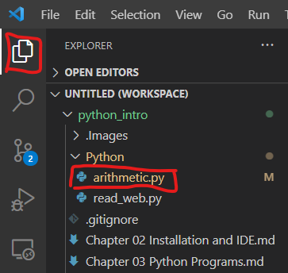
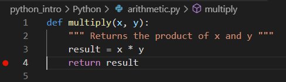
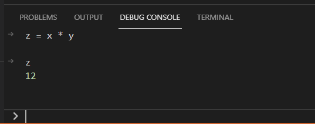

# Chapter 7 Debug in VSCode

This chapter differs from Chapter 7 of the book which focuses on the IDLE debugger.  Here the VSCode IDE and debugger are briefly explored.

VSCode provides powerful debugging capabilities for Python and other languages.  This document steps through the process of debugging Python code.  It also demonstrates how to pass arguments to your code in a debug session. 

## Folders
In VSCode, rather than opening a single file, it is more usual to open a folder (from the File Menu).  This is typically the source folder for a project.  Make sure you have cloned the repo with these notes called `python_intro`.  Then open this folder using the File Menu.  

## File
Next open a Python file.  For these notes, open the file `arithmetic.py` in the folder `Python`.  You can find this by selecting the `Explorer` in the top left:



When you open a Python file for the first time, a window may open prompting you to `Select Python Interpreter`.  You should do this and select an appropriate interpreter.  You'll see your interpreter in the bottom left.  You can click on this to change the interpreter:


You should now have `arithmetic.py` open in a window in VSCode.  The top portion of it contains a number of function definitions.  Near the bottom you will see the lines:
```python
if __name__ == "__main__":
    
    a, b = 3, 4
    print(f"Testing multiply({a},{b}) = {multiply(a,b)}")

    n = 5
    print(f"Testing sum_to_n({n}) = {sum_to_n(n)}")
```
This if statement is true when the Python file is being executed, as opposed to being imported into another Python file.  For instance, typing the following from the terminal will execute this file:
```
$ python arithmetic.py
```
The top functions will be defined, and then the lines of indented code following this if statement will be executed.

To run this file in the VSCode Debugger, click in the `arithmetic.py` file.  Then either press `F5` or click on the left-bar Debug icon followed by `Run and Debug` like below:


You'll see the following menu displayed and select `Python File`:


This will open a terminal panel, call a long command that runs `arithmetic.py`, and display the output from it:


## Adding Break Points

Try adding a break point to your code.  Click to the left of line 4 and you'll see a red dot.  This tells the debugger to stop when it reaches this line and before executing the line.



Now run the file again by pressing `F5` and selecting `Python File`.  You should see the code execution stop as below:


At this point you can hover the mouse over in-scope variables and see their values, such as `x`, `y` and `result`.  Alternatively, you can select the `Debug Console` in the bottom panel (next to `Terminal`).  In this window you can type Python commands in the current scope.  That is, you can try out functions on `x` and `y` which are currently in scope like this:



This is very useful for checking that your functions are operating as expected and for figuring out whey they aren't.  When you are ready to continue operation, press `F5` again or the `Continue` icon:


To quit execution in the middle, press `Shift-F5` or the `Stop` icon.

