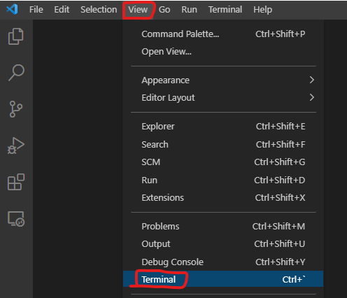

# Chapter 2: Python and IDE Installation

This chapter gives instructions for installing Python and Visual Studio Code on a Windows PC.  If you are reviewing Python for ECE-CSE 434, you can use Python and VSCode that are preinstalled for Ubuntu in the VDI Remote Desktop.

## Download & Install Python

While you can download and install the latest version of Python from [https://www.python.org/](https://www.python.org/), a simpler way in Windows is to type `python` from the command line.  This will take you to the Windows store and prompt to you download and install Python, which you can do.


## Test Python

In a command window type `python` and you should now see something like the following:
```
C:\Users\morri>python
Python 3.9.5 (tags/v3.9.5:0a7dcbd, May  3 2021, 17:27:52) [MSC v.1928 64 bit (AMD64)] on win32
Type "help", "copyright", "credits" or "license" for more information.
>>>
```
I you see this, then you have a working interactive Python interpreter.  You can exit it with:
```python
>>> exit()
```

## Visual Studio Code

These notes will use VSCode.  Download and install it from: [https://code.visualstudio.com/](https://code.visualstudio.com/).

### The Python Extension

VSCode supports Python formatting and color-coding through and extension.  To install the Python extension, click on the Extensions icon on the left, type `python`, select the top item from Microsoft, and click on install.


### Terminal in VS Code

You can open a terminal within VSCode.  In the `View` menu select `Terminal`:



Then from in the terminal type `python`


Note: if you have installed Python while VSCode is running, then Python may not be in your path.  You can simply restart VSCode, and that should solve it.

You can use Python within a VSCode terminal, or a separate terminal window; whichever you prefer.  The terminal defaults to PowerShell, which sometimes does not work well with Python.  If you have difficulties with running Python in PowerShell, you can switch to the Command shell from the pulldown menu on the top-right of the terminal panel (to the right of the `+` sign).

To make the `Command Prompt` default instead of `PowerShell`, do the following:
1. Press `Ctrl` + `Shift` + `p`
2. Type `profile` in the text box
3. Select `Terminal: Select Default Profile`
4. Select `Command Prompt`

You will need to restart VSCode for this to take effect.

### View Notes in VSCode

To open these notes in VSCode, first clone this repository.  Then in the `File` menu select `Open Folder` and open the cloned repo folder.  After you open a Markdown file (.md), click on the preview button on the top right to see it graphically.

### Auto Save

I prefer to edit with auto-save on, which is not the default.  You can toggle this option from the `File` menu.


___
### [Outline](README.md), Next: [Chapter 3: Python Programs](Chapter_03_Python_Programs.md)
