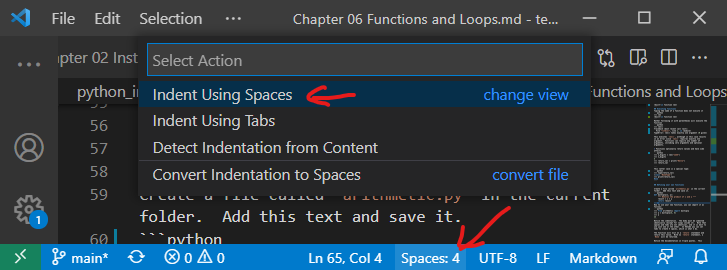

# Chapter 6: Functions and Loops

Example of a built-in function: `len()`
* Functions are values:
```python
>>> len
<built-in function len>
>>> type(len)
<class 'builtin_function_or_method'>
```
The name `len` can be reassigned:
```python
>>> len = "Hello"
>>> len
'Hello'
>>> type(len)
<class 'str'>
```
This is a bad idea because you no longer have access to the built-in function `len()`.  Doing this in your code creates confusion, so best to avoid it.  You can regain access to the built in function with
```python
>>> del len
>>> len
<built-in function len>
```
## Executing functions
Typing the name of a function **does not** execute it
```python
>>> len
<built-in function len>
```
Rather following it with parentheses will execute the function
```python
>>> len()
Traceback (most recent call last):
  File "<stdin>", line 1, in <module>
TypeError: len() takes exactly one argument (0 given)
```
This executes `len()`, although in this case results in an error since `len()` requires exactly one argument.  Functions can require any number of arguments, including zero arguments and optional arguments.  

* Functions optionally return values and have side effects
```python
>>> n_digits = len("1234")
>>> n_digits
4
>>> return_val = print("Hello")
>>> return_val

```
This latter case is a special type:
```python
>>> type(return_val)
<class 'NoneType'>
>>> print(return_val)
None
```

## Defining your own functions

Create a file called `arithmetic.py` in the the folder in which you are running Python.  Add this text and save it.
```python
def multiply(x, y):
    """ Returns the product of x and y """
    result = x * y
    return result    
```
Notice that `def` is used to define a function, followed by the function name, a list of paramters in parentheses, and finally a colon.  The following lines are the body of the function.

Now to use your new function, you can import it as follows:
```python
>>> from arithmetic import multiply
>>> a = multiply(3, 4)
>>> a
12
```
Notice the indentation.  The body must be indented identically (except for loops inside it).  Note that spaces and tabs are not identical, and it is best to use just one or the other.  In VSCode I set tabs to create 4 spaces by clicking on the `Spaces` or `Tabs` indicator on the bottom bar, and then selecting `Indent Using Spaces`, and then selecting the number of spaces:



The function will exit on a `return` statement and return this value.  With no `return` statement, a `None` will be returned.

Notice the documentation in triple quotes.  This starts on the line right after the function definition, and can extend to multiple lines.  This is provided to the help function as follows:
```python
>>> help(multiply)
Help on function multiply in module arithmetic:

multiply(x, y)
    Returns the product of x and y

```
So it is a good idea to document each function you write in this way.  For functions with many or complicated arguments, add explanations for each argument.

## Typing

Specifying the types of the input arguments and outputs of a function can make your code easier to understand.  Not only that, the basic concept is quite easy to implement.  Here is a simple modification of the `multiply()` function that illustrates how to specify argument types as well as the output type:
```python
def multiply(x: float, y: float) -> float:
    """ Returns the product of x and y """
    result = x * y
    return result
```
Note that Python does not impose type constraints during runtime and will not raise a `TypeError` if you input the wrong type and nor will it force the output to be of the specified type.  Those are the programmer's responsibilities.  But they do make it easier to decipher what the code is expecting, which you'll find is often a big help in using functions.  

There are many more details to specifying types such as multiple types, lists, callable functions etc., which you can find here: [https://docs.python.org/3/library/typing.html](https://docs.python.org/3/library/typing.html).

## Default Parameter Values

Function parameters can have default values and this makes them optional parameters.  In the above example, if you called `muliply(3.)`, you would get an error as `y` is a required parameter.  Let's say we defined our function as:
```python
def multiply(x, y=1.):
    """ Returns the product of x and y """
    result = x * y
    return result
```
Then `y` has a default value of `1.` and is optional.  Note that optional parameters need to be specified *after* all the required parameters.  If you want to specify types, you would write this function as:
```python
def multiply(x: float, y: float=1.) -> float:
    """ Returns the product of x and y """
    result = x * y
    return result
```

## Practice:

Create a function called `divide(x,y)` in `arithmetic.py` that returns `x/y`.  Confirm that you can import and use it.


## While Loops

A function to find the sum of integers from 0 to `n`.  Add this function to `arithmatic.py`:
```python
def sum_to_n(n):
    """ Finds sum of integers from 0 to n inclusive """
    i = 0
    sum_val = i
    while i <= n:
        sum_val += i
        i += 1
    return sum_val
```
Then from the python interpreter:
```python
>>> from arithmetic import sum_to_n
>>> sum_to_n(10)
55
```

## For Loops

For loops are a preferable way to iterate over a list or more generally a membership expression. A string is an example expression containing a sequence of letters.
```python
>>> for letter in "Hello":
...     print(letter)
... 
H
e
l
l
o
```
This is a `Pythonic` way to operate on letters; it is succinct and avoids unnecessary creation of an index variable to iterate through the string.  The following is a non-Pythonic way to do the same:
```python
>>> text = "Hello"
>>> i = 0
>>> while i < len(text):
...     print(text[i])
...     i += 1
... 
H
e
l
l
o
```
We get the same result, but less succinct, and has greater opportunities for bugs.  For example, if you omitted the line `i += 1`, the loop would iterate forever -- try it.  Pressing `Ctrl-C` will exit from such an infinite loop.   

### The `range()` function

The `range()` function provides a simple way to iterate over a numbers between two limits.  It begins with an optional start argument (which is zero by default), and continues up to but not including the target argument.  Some examples illustrate this:
```python
>>> for i in range(4):          # increment 0, 1, 2, 3
...     print(i)
... 
0
1
2
3
>>> for i in range(2,4):        # increment 2, 3
...     print(i)
... 
2
3
```

## Scope

A variable can have only one definition, within the **scope** of the variable.  Reassigning it will change its value.  However, in different scopes it may have different values.  Now the command line is a **global** scope.  A function defines a **local** scope within itself.  
```python
>>> a = 1       # Global variable
>>> b = 2       # Global variable
>>> def my_func():
...     b = 3   # Local variable supercedes global variable locally
...     c = 4   # Local variable
...     print(f"a: {a}, b: {b}, c: {c}")  # See global and local variables
...
>>> my_func()
a: 1, b: 3, c: 4
>>> b           # We are not in my_func() local scope so see global variable b
2       
>>> c           # c is not defined in this scope  
Traceback (most recent call last):
  File "<stdin>", line 1, in <module>
NameError: name 'c' is not defined      
```
Functions inside functions behave similarly; they inherit the scope of their parent function but also have a local scope not visible to their parent.

It is possible to define a variable as `global` from inside a function, but usually it is better practice to avoid using global variables inside a function.  

___
### [Outline](README.md), Next: [Chapter 7: Debug in VSCode](Chapter_07_Debug_in_VSCode.md)
