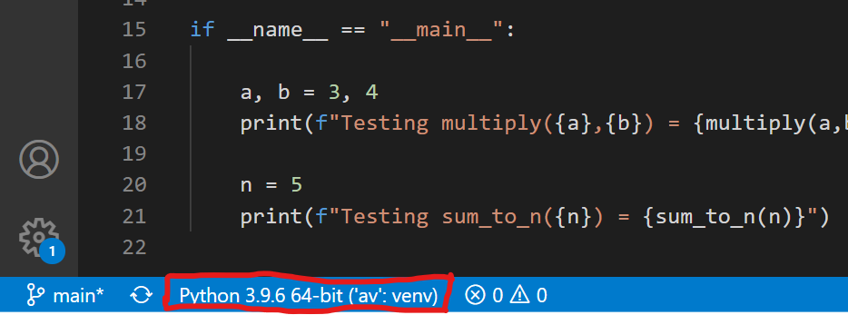

# Chapter 12: Virtual Environments

## Why Virtual Environments?

Python leaves much of its functionality to libraries.  Python code will import a library, or component of a library, and then can use it within the following lines of code.  Now most of these libraries do not come with the base Python install, but are part of packages that need to be installed before use.  Installing packages is simple and provides enormous functionality with just a few commands.

However, a downside of having a vast number of packages in Python is a compatibility problem.  Packages have many versions, and many versions of many packages are not compatible with each other.  To some extent, version compatibility can be handled by the installer, but package incompatibility means there are certain packages that cannot be installed at the same time.

The consequence of this incompatibility dilemma is that it is best that you do **not** install Python packages directly in the base Python environment.  Instead, create multiple separate virtual environments, and install the packages you need within each virtual environment.  It is easy to create virtual environments and to switch between them.  Instructions are given below. 

## Create a Virtual Environment

Likely you will create multiple virtual environments, so I recommend creating a folder to store them.  I typically create a folder called `venvs` in my `home` folder or in my `source` folder (depending if I'm in Linux or Windows).  Use `cd` to enter this folder in your terminal and then create a virtual environment with:
```
PS C:\Users\morri\source\venvs> python -m venv av
```
or with:
```
PS C:\Users\morri\source\venvs> python -m venv --system-site-packages av
```
(In Linux you may need to call `python3` rather than `python`).  This will create a virtual environment called `av`, but you can choose whatever name you like, and you can make as many virtual environments as you like each with their own name.  If you look in your `venvs` folder you will see an `av` folder that contains details of the `av` virtual environment, as well as any packages you install within it.  

The difference between the above two commands is the optional argument: `--system-site-packages`.  With this argument included, the virtual environment will inherit packages that are installed in the your base Python.  If you want your virtual environment to have all it's own packages, then don't include this.  But if the base Python already has packages you need and would rather not duplicate them in your virtual environment, then include this option.   

## Activate a Virtual Environment

To use a virtual environment you must activate it.  In Windows the `activate.ps1` script is located in the `Scripts` subfolder of the virtual environment.  Simply call this script to start your environment.  For example, if you are located in the folder containing the `venvs` folder, simply type:
```
PS C:\Users\morri\source> .\venvs\av\Scripts\activate.ps1
(av) PS C:\Users\morri\source>
```
In Linux you would type: `source envs/av/bin/activate`.  Notice that once a virtual environment has been activated, each line will begin with the environment name in parentheses.  This tells you that if you install python packages, they will be installed for that virtual environment, and if you start Python, you'll be starting in that environment.

Note: PowerShell by default does not permit running scripts, and may give you an error saying scripts are disabled for the system, see https://docs.microsoft.com/en-us/powershell/module/microsoft.powershell.core/about/about_execution_policies.  You can enable scripts as follows:
1. Run a PowerShell with administrative priviledges
2. Call this command: `Set-ExecutionPolicy RemoteSigned -Scope CurrentUser`

After doing this you should be able to activate your virtual environment.

When you are done with your environment, you can either activate another environment, or can deactivate it with `deactivate` like this:
```
(av) PS C:\Users\morri\source> deactivate
PS C:\Users\morri\source>
```

## An Easier Way to Activate your Virtual Environment

This section is purely optional and you can skip it if you prefer and move on to the next section: [Installing Packages](#installing-packages).

It can be tedious to type out the full path name in order to activate your virtual environment.  And you may have multiple virtual environments, making it not feasible to create an alias to activate each environment.  A solution to this is to create a PowerShell function for initializing your virtual environments.  To do this, first find your PowerShell `$profile` by typing:
```
echo $profile
```
This should return the full path and name of a script with a name like: `Microsoft.PowerShell_profile.ps1`.  Then open this file with Visual Studio Code, or create it if it doesn't exist, and add the following lines to it:
```
# Virtual environment folder: adjust the following path for your system:
$venvfolder = 'C:\Users\morri\source\venvs'
# ---
# Activate python virtual environments.  Call with:
#   act <virtualenv_name>
# Or call without arguments to get a list of virtual environments
function act([string]$virtualenv)
{
  if ($virtualenv -eq "")
  {
    Get-ChildItem $venvfolder
  } else 
  {
    $cmd = $venvfolder + "\" + $virtualenv + "\Scripts\activate.ps1"    
    & $cmd
  }
}
```
You'll need to change the line: `$venvfolder = 'C:\Users\morri\source\venvs'` to instead specify the full path to your `venvs` folder.  The function `act` (short for activate) created in this code will enable you to activate any virtual environment created in this folder.

Now this file is a script that is called each time a PowerShell is started.  To try it out, first open a new PowerShell.  In this new PowerShell test the function `act` by typing:
```
act
```
This should list the contents of your `venvs` folder, which will be your virtual environments.  You should see your recently created `av` virtual environment.  Then to activate the `av` virtual environment, simply type:
```
act av
```
If you create new virtual environments in this same `venvs` folder, you'll be able to activate any of them with: `act <environment_name>`

## Virtual Environments in Linux

We can set up a similar command in linux that will activate your virtual environment.  Let's create a folder `venvs` in your home folder to hold all your virtual environments, and in this create your `av` virtual environment as follows:
```
~$ mkdir venvs
~$ cd venvs
~/venvs$ python3 -m venv av
```
Note that in linux you'll need to use `python3` to create the virtual environment.  Now let's create the `act` command for activating it.  Add the following text to your `.bashrc` file:
```
# Command to activate selected virtual environment:
VENV_FOLDER=$HOME/venvs                   # Change this as appropriate
act() {
  if [ $# -eq 0 ]
  then
    ls $VENV_FOLDER                       # If no arguments, display all virtual environments
  else
    cmd="source $VENV_FOLDER/${1}/bin/activate"   # Activate selected virtual environment
    echo $cmd
    eval $cmd
  fi
}
```
Then execute your `.bashrc` file with:
```
~$ source ~/.bashrc
```
After this you can type `act` to list your virtual environments, or else you can activate your environment with:
```
~$ act av
source /home/dmorris/venvs/av/bin/activate
(av) ~$
```
Now when you type `python` (not `python3`), it will use your virtual environment.  As usual, use `deactivate` when you no longer want to use it.

## Installing Packages

As mentioned above, it is best not to install packages in your base Python environment, but rather to install them in a virtual environment.  Start by activating your environment as explained above, and you'll see `(av)` at the start of each line.  Then make sure you have a recent version of `pip` by upgrading `pip` with this command:
```bash
(av) PS C:\Users\morri\source> python -m pip install --upgrade pip
Collecting pip
  Using cached https://files.pythonhosted.org/packages/09/bd/2410905c76ee14c62baf69e3f4aa780226c1bbfc9485731ad018e35b0cb5/pip-22.3.1-py3-none-any.whl
Installing collected packages: pip
  Found existing installation: pip 19.2.3
    Uninstalling pip-19.2.3:
      Successfully uninstalled pip-19.2.3
Successfully installed pip-22.3.1
```
Now you are ready to install `numpy`, a package we will use in the next chapter.  Use the following command:
```bash
(av) PS C:\Users\morri\source> python -m pip install numpy
Collecting numpy
  Downloading numpy-1.21.2-cp39-cp39-win_amd64.whl (14.0 MB)
     |████████████████████████████████| 14.0 MB 6.4 MB/s
Installing collected packages: numpy
Successfully installed numpy-1.21.2
```
Here the `numpy` package was successfully installed in the `av` environment.  

## Run Python

Once you have installed the packages you need, simply call `python` from the command line to run it:
```
(av) PS C:\Users\morri\source> python
Python 3.9.6 (tags/v3.9.6:db3ff76, Jun 28 2021, 15:26:21) [MSC v.1929 64 bit (AMD64)] on win32
Type "help", "copyright", "credits" or "license" for more information.
>>>
```
Within VSCode, you can select this virtual environment for running your Python code by first opening a Python file.  Then in the bottom left menu bar you'll see the selected Python environment like this:



If a different environment appears, click on it, and select the virtual environment you just created.  You may need to specify the path to the Python executable in `venvs/av/bin/python.exe`.  Then you should see your virtual environment show up as above.


___
### [Outline](../README.md), Next: [Chapter 13: Numpy](Chapter_13_Numpy.ipynb)


