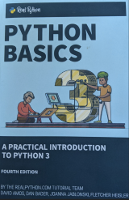

# Python Basics: Companion Notes

## Daniel Morris, PhD
___

These are companion notes that summarize and add some material to the Python concepts taught in the following book:   

### **[Python Basics: A Practical Introduction to Python 3](https://realpython.com/products/python-basics-book/)**
### By: **David Amos, Dan Bader, Joanna Jablonski, Fletcher Heisler**
4th edition, 2021

___
## **Outline**

* [Chapter 1: Introduction](Chapter_01_Introduction.md) `*`
* [Chapter 2: Installation and IDE](Chapter_02_Installation_and_IDE.ipynb) `*`
* [Chapter 3: Python Programs](Chapter_03_Python_Programs.md)
* [Chapter 4: Strings and Indexing](Chapter_04_Strings_and_Indexing.md)
* [Chapter 5: Numbers and Math](Chapter_05_Numbers_and_Math.md)
* [Chapter 6: Functions and Loops](Chapter_06_Functions_and_Loops.md)
* [Chapter 7: Debug in VSCode](Chapter_07_Debug_in_VSCode.md) `*`
* [Chapter 8: Conditional Logic and Control Flow](Chapter_08_Conditional_Logic_and_Control_Flow.md)
* [Chapter 9: Tuples, Lists and Dictionaries](Chapter_09_Tuples_Lists_and_Dictionaries.md)
* [Chapter 10: Classes](Chapter_10_Classes.md)
* [Chapter 11: Modules and Packages](Chapter_11_Modules_and_Packages.md)
* [Chapter 12: Virtual Environments](Chapter_12_Virtual_Environments.md) `*`
* [Chapter 13: Mathematical Tools](Chapter_13_Mathematical_Tools.ipynb) `*`
* [Chapter 14: Conclusion](Chapter_14_Conclusion.md) `*`
* [Appendix 1: Solving Linear Equations](Appendix_01_Linear_Equations.md) `*`
* [Appendix 2: Data Series and Plotting](Appendix_02_Data_and_Plotting.ipynb) `*`

`*` These chapter topics differ significantly from those in the book.

___
## Who Are These Notes For?

The notes are self-contained but fairly terse, and are intended for someone versed in other programming languages to quickly learn the syntax, style and peculiarities of Python.  Hence, given some programming background, they can be followed without using the book.  

The notes are also only a basic introduction to Python and are not comprehensive.  After completing them you should be comfortable programming basic capabililties in Python.  Once you are at that level, it is fairly simple to learn new features through a web or [Stack Overflow](https://stackoverflow.com/) search.  

If, on the other hand, you are new to programming, then these notes may be too terse, and it would be preferable to follow the book or do an [online tutorial](https://docs.python.org/3/tutorial/index.html).    

___
### Next: [Chapter 1: Introduction](Chapter_01_Introduction.md)
